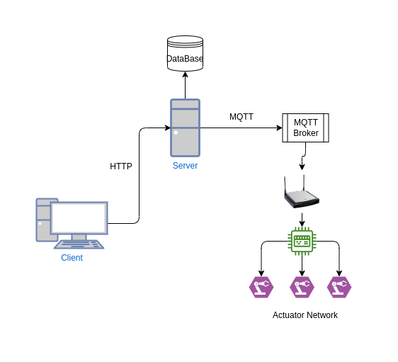
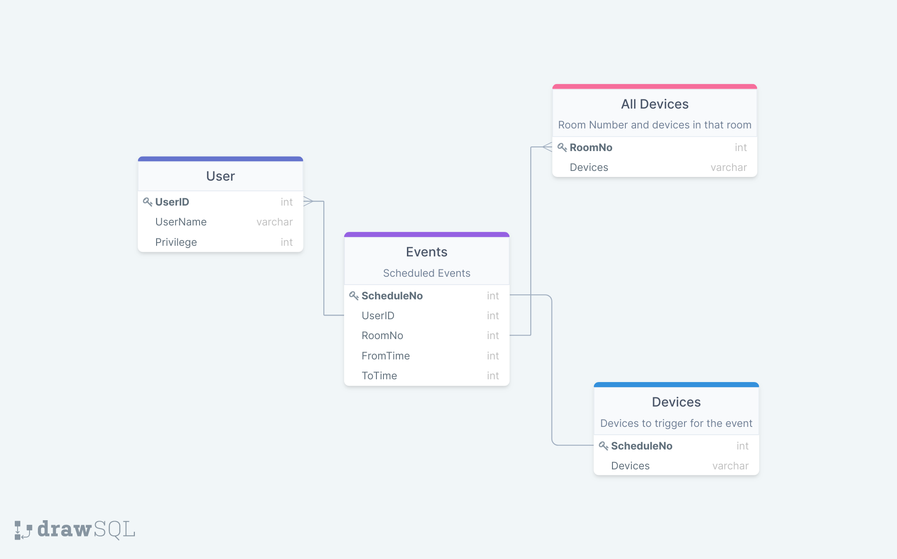

# IOT Based Scheduling System

## Abstract
An IOT based scheduling system is described. The system aims to provide an interface to schedule an event which can trigger the action of various IOT based actuators in an actuator network at the scheduled time. The algorithm can be used for various applications including room booking, automated actuation of different embedded devices in an IOT network. The infrastructure uses a centralised server responsible for data storage, triggering scheduled events and other basic tasks like avoiding collisions in the schedule timings. The system provides a web interface for event scheduling which uses HTTP for communication with the server. The embedded features Actuator network which is connected to the server via the MQTT protocol which is a favourable platform for low end embedded communication.

## Introduction
The design aims to automate timed actuation of intended IOT devices which are part of a connected network at the user endpoint. This is achieved by querying and storing the activation time and devices to be activated for an event from the user. Then, the data is preserved in a database at the server. A timed event is created by the server which is triggered at the required time. This provides a way to automate pre-determined activation of physical hardware eliminating the need for manual operation which can be imprecise and time consuming.
### Scenario
A typical use case for the proposed system is described.Consider a school containing few classrooms. Each of them may contain a few electronic devices installed to aid the process of teaching. A typical scenario may involve a teacher manually switching on all the required devices they need, at the start of the class. This is time consuming and can be a way of distraction for the class. Instead, the teacher can schedule an event in the proposed system which includes the starting and ending time of their class along with the required devices they need for that class. By doing so, he can offload the task of manual initialization of the devices at the beginning of the class. The system takes the responsibility to detect the schedule timing and automate the process of initiating the devices.
Apart from the above scenario, the system also finds several use cases in automating the activity of home appliances at the instance when the owner usually arrives home and other interesting industrial and medical applications requiring automated and timing critical activity.

## Design Implementation
The entire system is controlled and co-ordinated by a central server. This server is responsible to store schedule data and trigger different callbacks at the scheduled time. This implementation uses Express, a NodeJS framework to implement the server. The server provides various APIs which act as a gateway for devices to interact with it. The server also features a Relational Database System which is helpful to store and interact with event data that is stored in a database. This particular design uses an SQLite database for database management.

The infrastructure for the proposed system is as depicted below:

The application provides a web based interface which is used to set event details by the user. This is essential to enable human interaction with the system. The interface is built using basic frontend web languages like HTML, CSS and JS. It accepts user data and communicates them with the server through various API calls over HTTP.

Schema for the Relational database used is as shown:

The network containing Embedded actuators is also connected to the server through MQTT protocol. An MQTT Broker is set up on the cloud which is responsible to receive, manage and deliver MQTT messages. Whenever an event needs to be triggered, the server queries the required data from the database and posts an MQTT message to the broker, which is later delivered to the concerned devices. MQTT is used explicitly due to its lower requirement computational overhead which is crucial for low end embedded devices.

## TECHNICAL STACK
The following describes various technologies and frameworks used to implement the application. These are specific to this implementation and can be replaced with any other alternatives of choice.
The central server which is responsive to coordinate various actions is implemented using Express in nodeJS. The Database is an SQLite instance featuring four relational tables to store information regarding user data, schedule timing etc. 

